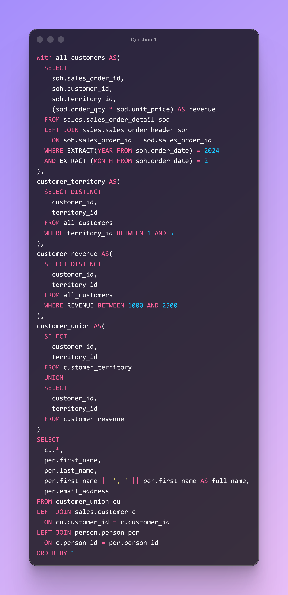

# DAY EIGHTEEN CHALLENGES
## OBJECTIVE
**Demonstrate expertise in using CTE structures and set‑logic operators—particularly UNION and UNION ALL—to consolidate customer data derived from different filtering rules. This ensures accurate merging of customer datasets, eliminates unintended duplicates, and produces a clean, enriched customer list joined to person‑level details.**

**Question 1**

**Use Case:**Sales and territory analytics teams need a consistent method to identify all customers active in February 2024 across multiple conditions. One group requires territory filtering (1 to 5), while another requires filtering by revenue ranges (between 1000 and 2500). A unified view allows analysts to track customer overlap, territory performance, and early‑stage customer value signals without manually reconciling separate datasets.

**Business Impact:**  Enable the organization avoids duplicate customer counting, inflated performance numbers, and inconsistencies across teams. Enhances forecasting accuracy, improves territory coverage strategies, and strengthens marketing and sales execution.

**Action:**  Produce a consolidated customer‑territory list using the CTE‑driven SQL query, combining date‑filtered and revenue‑filtered results through a UNION operation. Deliver the dataset to downstream analytics so they can generate territory heatmaps, customer activity trends, and early‑value indicators for February 2024.
  

