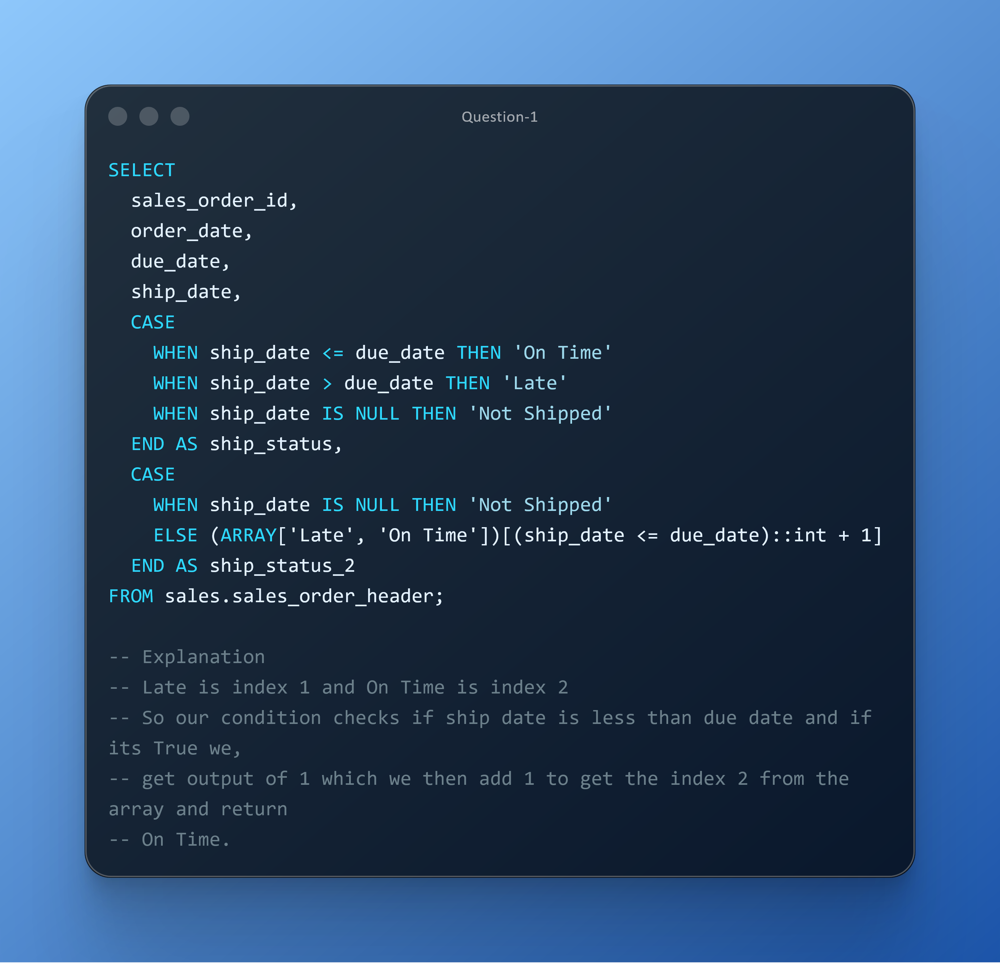

# DAY ELEVEN CHALLENGES
## OBJECTIVE
**Show proficiency in applying SQL CASE logic to categorize shipments as On Time, Late, or Not Shipped for SLA analysis**

**Question 1**

**Use Case:** Logistics needs to classify orders as On Time, Late, or Not Shipped to monitor SLA adherence and drive operational improvements. 

**Business Impact:** Reduces late shipments and strengthens customer satisfaction.

**Action:**  Produce a compliance dashboard with shipment status breakdown.

