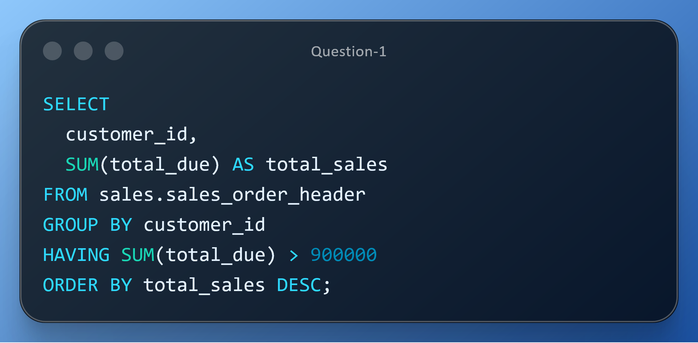
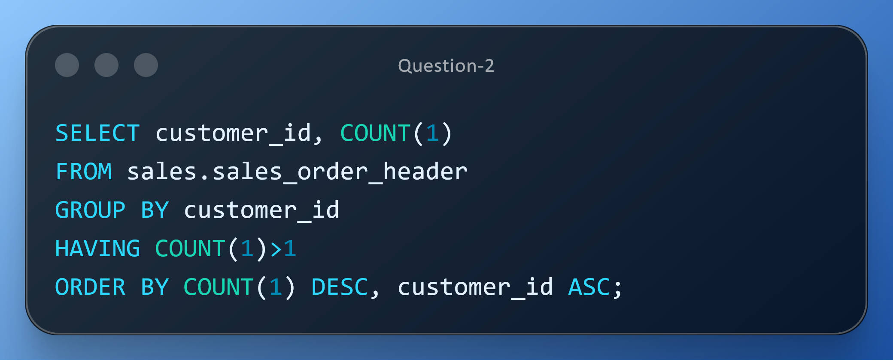

# DAY FOUR CHALLENGES
## OBJECTIVE
**This exercise demonstrates advanced SQL aggregation and filtering using the HAVING clause to address real-world business needs. It identifies high-value customers for loyalty targeting and detects duplicates or multi-order customers to improve data quality. These queries showcase how HAVING enables post-aggregation filtering, which is essential for accurate analytics and strategic decision-making**

**Question 1** 
**Use Case:** Finance is launching a premium loyalty program. They need customers whose total purchases exceed $900,000, prioritized for white-glove service and retention investments.  
**Business Impact:**  Improves retention, grows CLV, and focuses perks where ROI is highest. 
**Action:** Generate a ranked list of high-value accounts for loyalty targeting. 

**Question 2** 
**Use Case:** Customer Service suspects duplicates in the customer master and wants to cross-check customers with multiple orders to assess profile hygiene and engagement. 
**Business Impact:** Reduces data confusion, improves customer communications, and ensures reliable analytics. 
**Action:**  Deliver duplicate findings and engagement counts for remediation planning. 

