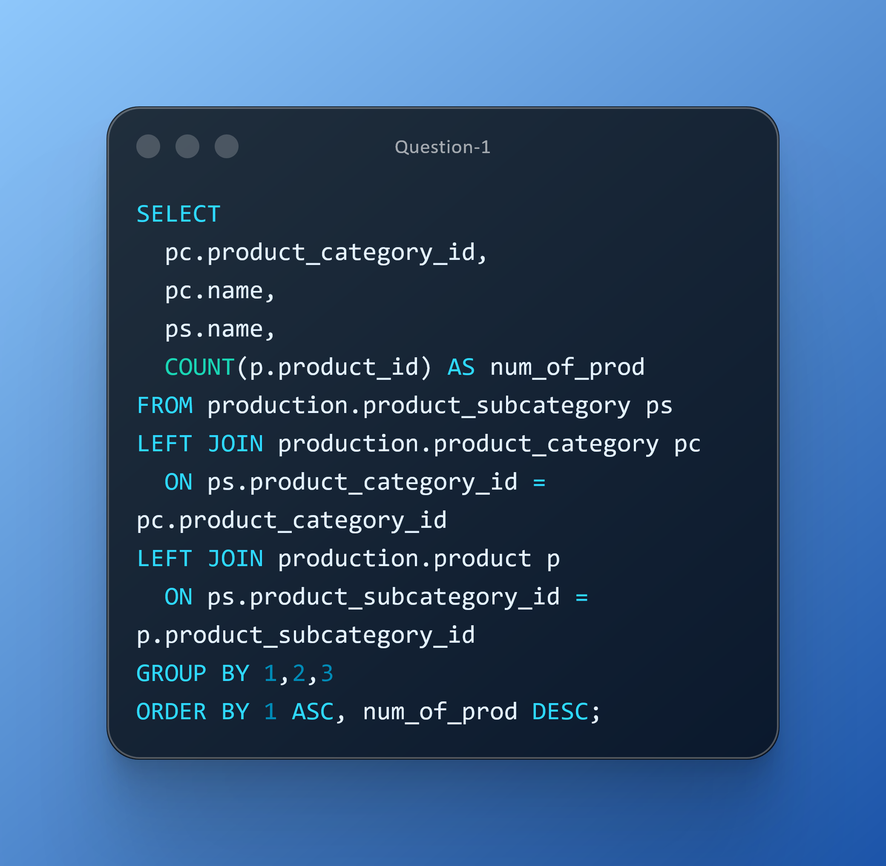
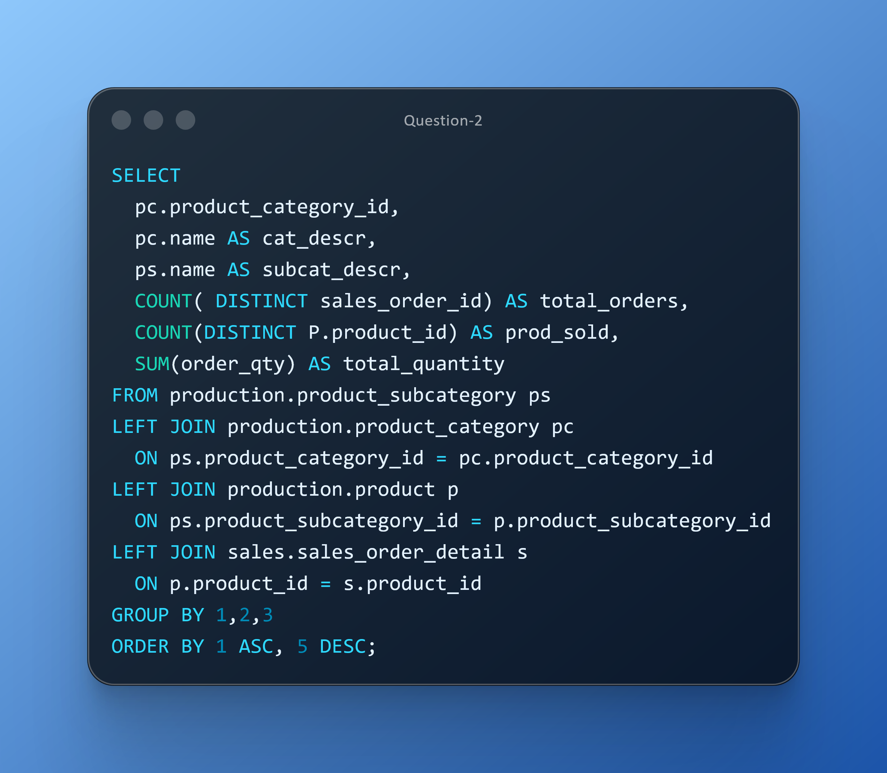

# DAY NINE CHALLENGES
## OBJECTIVES
**Apply and integrate previously learned SQL concepts into a practical business scenario while ensuring data accuracy and integrity. You will develop advanced SQL skills by creating queries that deliver actionable category-level insights for portfolio optimization and sales strategy.**

**Question 1** 
**Use Case:** The Category Manager needs an overview of product counts by category and subcategory to identify portfolio imbalances and opportunities for SKU rationalization. 
**Business Impact:** Optimizes assortment strategy and reduces catalog complexity. 
**Action:** Deliver a portfolio distribution report with category/subcategory counts. 

**Question 2** 
**Use Case:** Sales Analytics seeks order volume, products sold, and total quantities by category and sub category to measure demand strength and breadth of adoption. 
**Business Impact:** Guides replenishment planning and category-level sales strategy. 
**Action:** Publish a category performance summary with volume and breadth indicators. 

