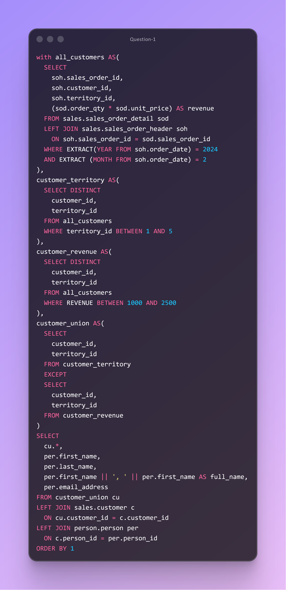

# DAY NINETEEN CHALLENGES
## OBJECTIVE
**Demonstrate expertise in using CTE structures and set‑logic operators—particularly UNION and UNION ALL—to consolidate customer data derived from different filtering rules. This ensures accurate merging of customer datasets, eliminates unintended duplicates, and produces a clean, enriched customer list joined to person‑level details.**

**Question 1**

**Use Case:**Sales and Territory Analytics need to distinguish two critical segments for February 2024:
- Intersection – customers who satisfy both the territory criteria (territory_id 1–5) and the revenue criteria (order line revenue between 1,000 and 2,500).
- Exclusion – customers who satisfy the territory criteria but not the revenue criteria (i.e., remove overlapping customers).

**Business Impact:**  
- Ensures clean segmentation for differentiated go‑to‑market motions (e.g., targeted offers for the overlap segment versus nurture or re‑engagement for the territory‑only segment).
- Reduces wasted spend and double‑counting, resulting in more accurate territory metrics, improved campaign qualification, and higher ROI.
- Improves forecasting and capacity planning by clarifying the true size and behavior of each segment.
- 
**Action:**  Produce the two datasets for both scenarios of February 2024 to downstream analytics, Sales Ops, and Marketing activation workflows.
  

