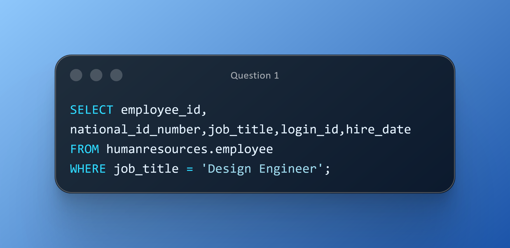
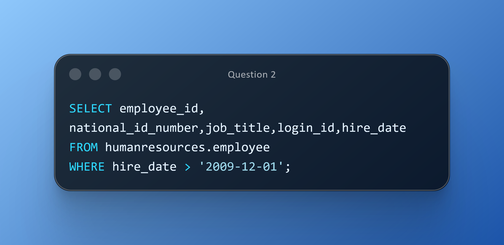
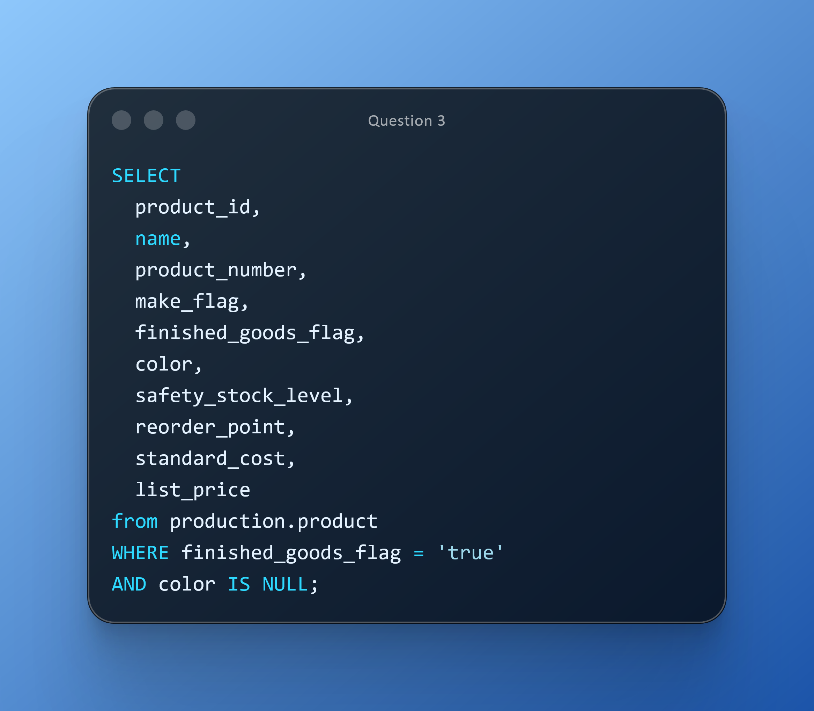

# DAY ONE CHALLENGES
## OBJECTIVE
Demonstrate the ability to write accurate SQL queries using SELECT, FROM, and WHERE clauses to retrieve targeted business data from relational tables. 
The goal is to solve real-world scenarios such as identifying design capacity within HR, tracking new hires, and analyzing product attributes in the supply chain.

## Question 1
**Use Case:** ApexMobility is launching a new high-performance bicycle line. The Engineering Stakeholder needs to assemble a specialized design team for the project. 
To do this, they require a list of all employees currently holding the title ‘Design Engineer,’ including their hire dates and login IDs, to verify experience and system access before assigning them to the innovation team.

**Business Impact:** Ensures the right talent and adequate tenure/experience are aligned to a strategic product initiative, accelerating time-to-market. 
**Action:** Prepare a stakeholder-ready roster and summary notes.

## Question 2
**Use Case:** Following several campus recruitment drives, HR wants to identify employees who joined after December 1, 2009, to track onboarding throughput, confirm contract statuses, and plan probation review cycles. 
**Business Impact:** Improves early-stage talent management, reduces compliance risks, and optimizes onboarding capacity. 
**Action:** Compile a clean, auditable list of recent hires with key identifiers. 

## Question 3
**Use Case:** The Supply Chain team plans production runs for spring catalogs. They need to locate in-house manufactured items that are categorized and marked as finished goods but still lack color attributes—these fields drive bill of materials (BOM) accuracy and catalog presentation.
**Business Impact:** Reduces data errors in BOMs and avoids catalog inconsistencies, decreasing rework and customer confusion. 
**Action:** Deliver a prioritized data-cleanup inventory with impacted SKUs. 

