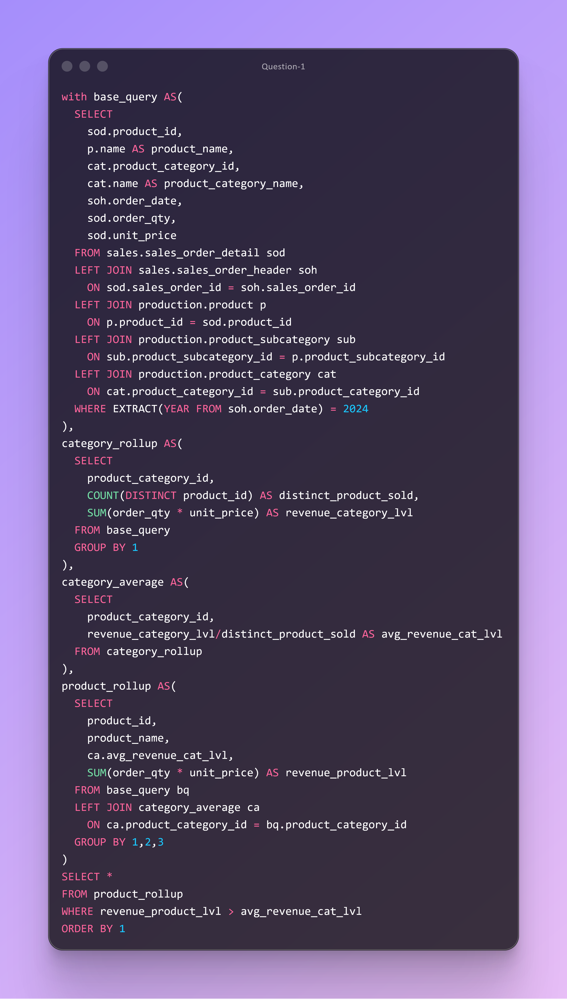

# DAY SEVENTEEN CHALLENGES
## OBJECTIVE
**Leverage CTE‑driven data modeling, multi‑table joins, and category benchmarks to pinpoint 2024 products that outperform their category’s average revenue. This analysis surfaces revenue‑leading products by comparing product‑level sales against category‑wide average revenue, enabling precise product performance evaluation.**

**Question 1**

**Use Case:** Product, Merchandising, and Commercial Analytics teams need a clear view of which products meaningfully exceed their category’s average revenue contribution. By calculating category‑level average revenue per product and then isolating items with revenue above that benchmark, stakeholders can quickly identify top performers, prioritize SKU investments, and guide category strategy with data‑driven precision.**

**Business Impact:** The insights enable the organization to:
- Pinpoint high‑performing products that disproportionately drive category revenue and merit increased inventory, marketing, or pricing focus.
- Detect strong SKUs that may be candidates for cross‑selling, bundling, or expansion into additional channels.
- Prioritize profitable products while reducing complexity from underperforming SKUs, improving margin and operational efficiency.
- Strengthen assortment planning with fact‑based visibility into which products truly differentiate each category.

By identifying product‑level revenue leaders, the business can make more targeted investments that elevate overall category performance and accelerate revenue growth.

**Action:**  Deliver a filtered list of products whose 2024 revenue exceeds their category’s average revenue. Present the output in an executive summary highlighting top outperforming SKUs, category implications, and recommended next steps—such as inventory scaling, promotional emphasis, or deeper profitability analysis.
  

