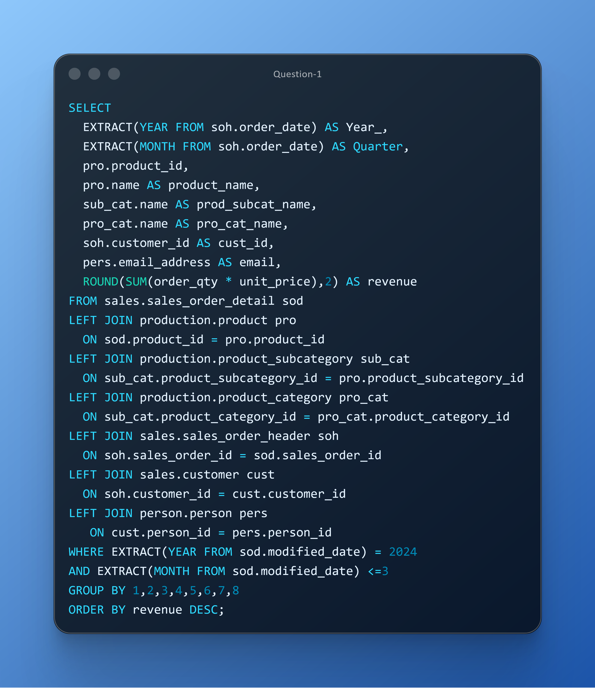

# DAY TEN CHALLENGES
## OBJECTIVES
**Design data product for Q1 2024 revenue trends analysis by product, subcategory, category, and customer using advanced SQL techniques. Enables informed pricing decisions and margin optimization through accurate, granular revenue insights.**

**Question 1** 
**Use Case:** Finance needs Q1 2024 revenue data segmented by product, subcategory, category, and customer to analyze profitability trends and refine discount strategies. Note: Revenue is calculated as order_qty × unit_price. 
**Business Impact:**Supports pricing decisions and margin optimization. 
**Action:** Prepare a Q1 revenue rollup with product/category granularity. 

