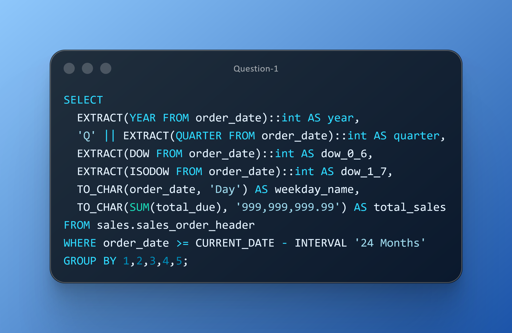

# DAY THIRTEEN CHALLENGES
## OBJECTIVE
**Demonstrate expertise in leveraging SQL date functions and advanced grouping techniques to generate multi‑level revenue insights—including weekday sales patterns and year/quarter/month rollups—to support accurate forecasting and seasonality evaluation.**

**Question 1**

**Use Case:** Analytics teams need a multi‑year, day‑of‑week revenue trend aggregated by year, quarter, weekday number, and weekday name to uncover sales patterns, weekly seasonality, and performance shifts over the past 24 months. 

**Business Impact:** This enables Finance and Sales to make more accurate forecasts, optimize staffing and promotional timing, and identify high‑ and low‑performing days of the week—strengthening operational planning and revenue management.

**Action:**  Deliver a year‑quarter‑weekday revenue summary using SQL date functions (EXTRACT, TO_CHAR) to present clean, interpretable trends. Share the resulting weekday‑based sales pattern with insights and recommended follow‑up actions.

