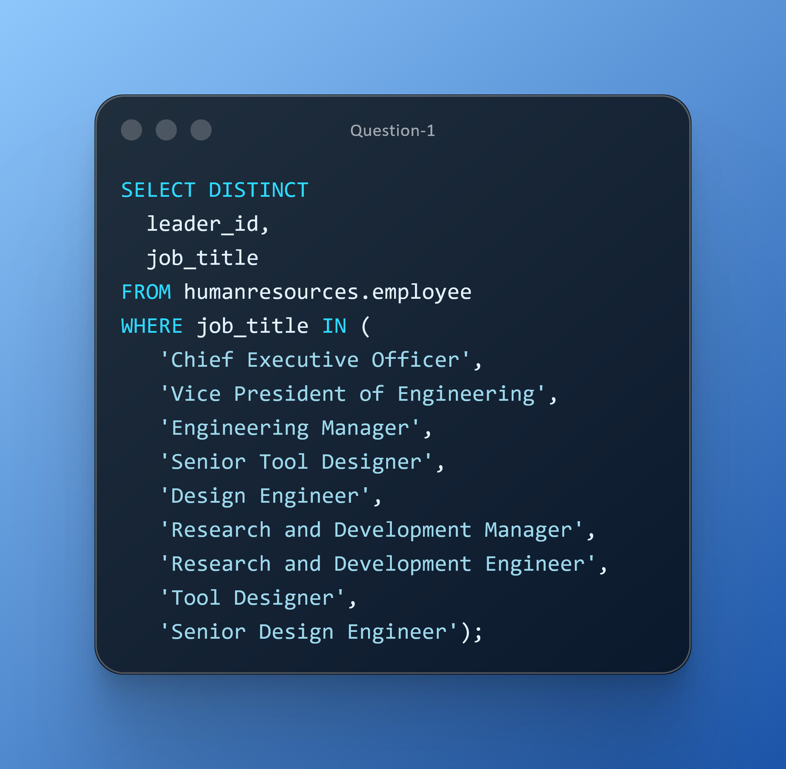
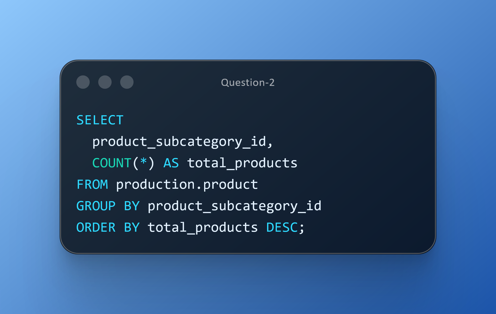

# DAY THREE CHALLENGES
## OBJECTIVE
**Showcase your ability to use SQL aggregate functions along with key operators like DISTINCT and IN to solve real business problems.  
In this challenge, you’ll extract and organize leadership roles for succession planning and reporting structure reviews,  
and summarize product counts by subcategory to support inventory and category-level insights.**

**Question 1** 
**Use Case:** HR wants a leadership map (CEO to senior design roles) to review reporting structures, succession planning, and headcount allocation across engineering leadership tiers. 
The focus includes key positions such as Chief Executive Officer, Vice President of Engineering, Engineering Manager, Senior Tool Designer, Design Engineer, Research and Development Manager, 
Research and Development Engineer, Tool Designer, and Senior Design Engineer. 
**Business Impact:** Strengthens leadership visibility and succession pathways for critical design functions. 
**Action:** Deliver a deduplicated leadership listing for org mapping. 

**Question 2** 
**Use Case:** Operations needs an at-a-glance inventory health summary: total products by subcategory to prepare for seasonal demand. 
**Business Impact:** Supports proactive stock planning and reduces stockout/overstock risk. 
**Action:** Publish a KPI summary sheet with key inventory metrics. 

