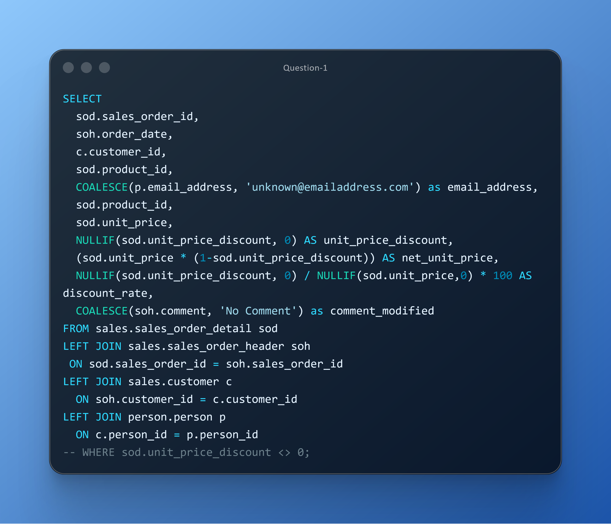

# DAY TWELVE CHALLENGES
## OBJECTIVE
**Demonstrate mastery in using SQL functions such as NULLIF, COALESCE, and calculated expressions to reliably generate discount metrics, compute net pricing, and standardize missing data fields, ensuring a complete and analysis‑ready sales dataset.**

**Question 1**

**Use Case:** Sales analytics needs a reliable way to compute effective line‑item discount rates while preventing divide‑by‑zero errors, and they want to ensure customer records always contain an email by providing a fallback value. They also require a standardized placeholder when order comments are missing so downstream reporting remains consistent. 

**Business Impact:** Improve accuracy in discount analysis and ensures complete contact data for communications. Improves the accuracy and safety of discount‑related metrics by preventing null or zero‑value errors and ensures complete customer and order‑level data. Standardized email and comment fields eliminate reporting gaps and support cleaner dashboards, communication workflows, and data exports.

**Action:**  Deliver an enriched transactional dataset with safe discount metrics.

