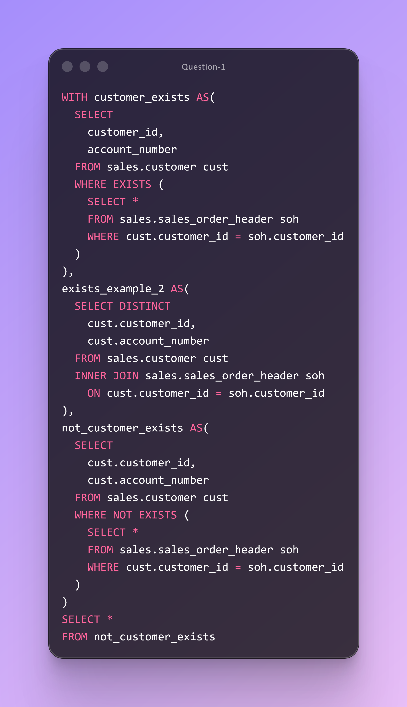

# DAY TWENTY CHALLENGES
## OBJECTIVE
**Demonstrate the ability to apply SQL EXISTS and NOT EXISTS logic to accurately identify customers who have—or have not—engaged in specific purchasing behaviors. This ensures precise audience segmentation based on transactional activity.**

**Question 1**

**Use Case:**The business needs to identify customers whose purchase behavior qualifies or disqualifies them for targeted programs. Isolate customers who have placed orders, as well as customers with no order activity. These segments are essential for campaigns such as re‑engagement, first‑purchase incentives, and cross‑sell opportunities.

**Business Impact:**  
Improves targeting accuracy by ensuring customers are placed into the correct behavioral segments. Reduces wasted marketing spend, increases campaign relevance, and supports more effective engagement strategies—ultimately driving higher conversion rates and customer lifetime value.

**Action:**  Use EXISTS and NOT EXISTS queries to generate precise customer lists based on defined purchasing criteria. Deliver the resulting segments as ready‑to‑activate audience files for marketing, retention, and cross‑sell initiatives.

