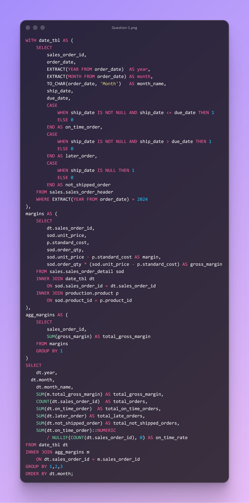

# DAY TWENTYONE CHALLENGES
## OBJECTIVE
**Provide a trusted, month‑level view of 2024 sales performance by combining gross margin and fulfillment timeliness. Use robust SQL patterns (COALESCE, NULLIF, CASE) to prevent divide‑by‑zero, standardize missing cost data, and correctly classify order shipping status, resulting in a complete, analysis‑ready dataset for operational and financial decision‑making.**

**Question 1**

**Use Case:** Operations and Finance need a single monthly dataset for 2024 that blends profitability and service performance. Specifically, they want:

- **Total Gross Margin** aggregated from line items using unit_price - standard_cost.
- **On‑time, late, and not‑shipped counts** using ship_date and due_date.
- On‑time rate.

This enables monitoring of OTIF (on‑time, in‑full proxy via on‑time ship) and margin trends together, identifying bottlenecks (late vs. not shipped) and trade‑offs between service and profitability.

**Business Impact:** 

- **Service Reliability & SLA Compliance:** Quantifies late vs. not‑shipped orders to target root causes (capacity constraints, supplier delays, pick/pack issues).
- **Margin Optimization:** Surfaces months and cohorts where margin erodes despite healthy volume—informing pricing, discounting, and mix decisions.
- **Inventory & Fulfillment Planning:** Not‑shipped signals demand‑supply imbalances; trends inform safety‑stock, lead‑time, and expedite policies.
- **Executive Reporting:** One consistent monthly lens tying financial outcomes (gross margin) to operational outcomes (on‑time rate) for faster, aligned decisions.

**Action:** Deliver a monthly 2024 performance dataset with the following fields and guarantees:

## **Fields (per month)**
- year, month  
- total_margin (SUM of line-level (qty * (unit_price - standard_cost)))  
- total_orders  
- total_on_time_orders, total_late_orders, total_not_shipped_orders  
- on_time_rate = SUM(on_time_orders) / COUNT(sales_order_id)  

## **Data Contracts / Definitions**
- On-time: ship_date <= due_date  
- Late: ship_date > due_date  
- Not shipped: ship_date IS NULL  
- Gross margin: revenue proxy via unit_price minus standard_cost (line-expanded, summed by order, then by month).  

## **Operationalization**
1. Schedule daily refresh for the prior and current months; monthly full refresh for historical stability.  

**2. Quality checks**

  - Enforce non-negativity where appropriate; allow negative margin flags for exception review.  
  - Validate that monthly total_on_time + total_late + total_not_shipped == total_orders.  
  - Alert on sudden spikes in not_shipped or drops in on_time_rate.  

**3. Delivery**
- Publish as a certified dataset for BI (Power BI / Tableau) and surface a “2024 Margin & On-Time Dashboard.”  

**4. Owners & Routing**
- Assign Ops for timeliness KPIs, Finance for margin review, and Data Engineering for pipeline SLAs.  

