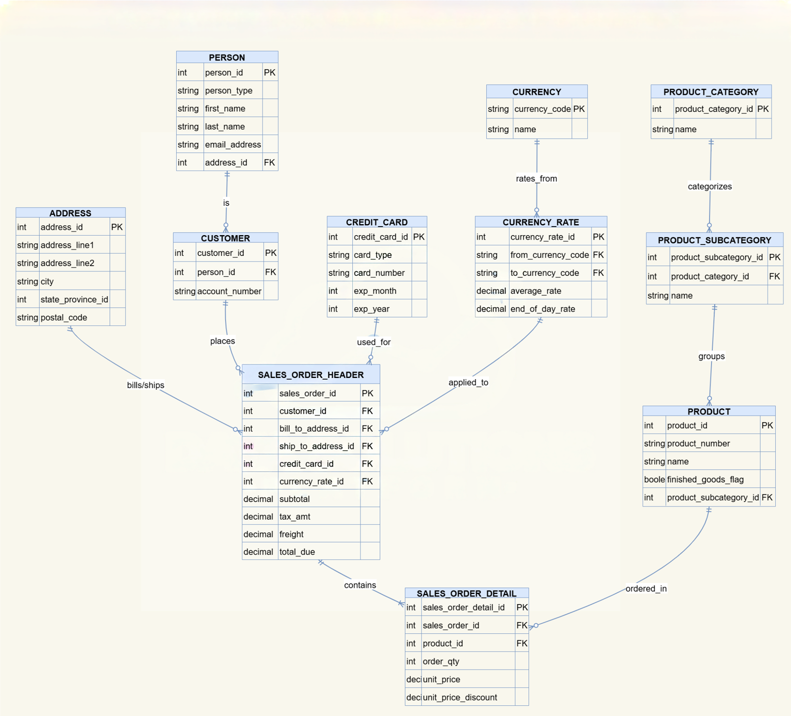

# Entity Relationship
### Showing relationships of how data in the tables connect

## Core Relationships
* Person → Customer → Sales Orders
* Product Category → Product Subcategory → Product
* Sales Orders → Order Details → Products
* Currency & Currency Rates → Sales Orders
* Employee → Department → Shift 
These relationships support both transactional integrity and analytical reporting.

## Notes
* This model supports **global operations**, including multi-currency sales.
* Temporal tables (history tables) allow accurate tracking of organizational and payroll changes.
* The schema follows **relational best practices** and supports analytical and transactional workloads.
